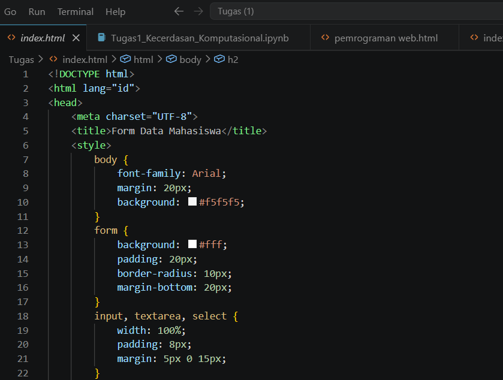

<h1 align="center">KELOMPOK PEMROGRAMAN WEB</h1>

Anggota Kelompok:

-Muhammad Dwi Firmansyah_202412012

-Nabil

-Yovitha Gracia Tavares_202412044

       }
        input, textarea, select {
            width: 100%;
            padding: 8px;
            margin: 5px 0 15px;
            box-sizing: border-box; /* Tambahan agar padding tidak merusak lebar 100% */
            ========================================================
            ghytfrters
            ========================================================
        }

        /* Khusus untuk textarea agar tidak bisa diubah ukurannya */
        textarea {
            resize: none;
            height: 80px; /* Menentukan tinggi kotak alamat */
            ========================================================

            ========================================================
        }

        .icon-aksi {
            width: 20px;       /* Atur lebar gambar */
            height: 20px;      /* Atur tinggi gambar */
            object-fit: cover; /* Agar gambar tidak gepeng */
            vertical-align: middle;
            ========================================================

            ========================================================
        }

        .aksi a {
            display: inline-block;
            padding: 2px;
            ========================================================

            ========================================================

        }
    <label>Jenis Kelamin</label> 
    <input type="radio" name="jk" value="Pria"> Pria
    <input type="radio" name="jk" value="Wanita"> Wanita
      
    =====================================================

    =====================================================

</body>
</html>/*
